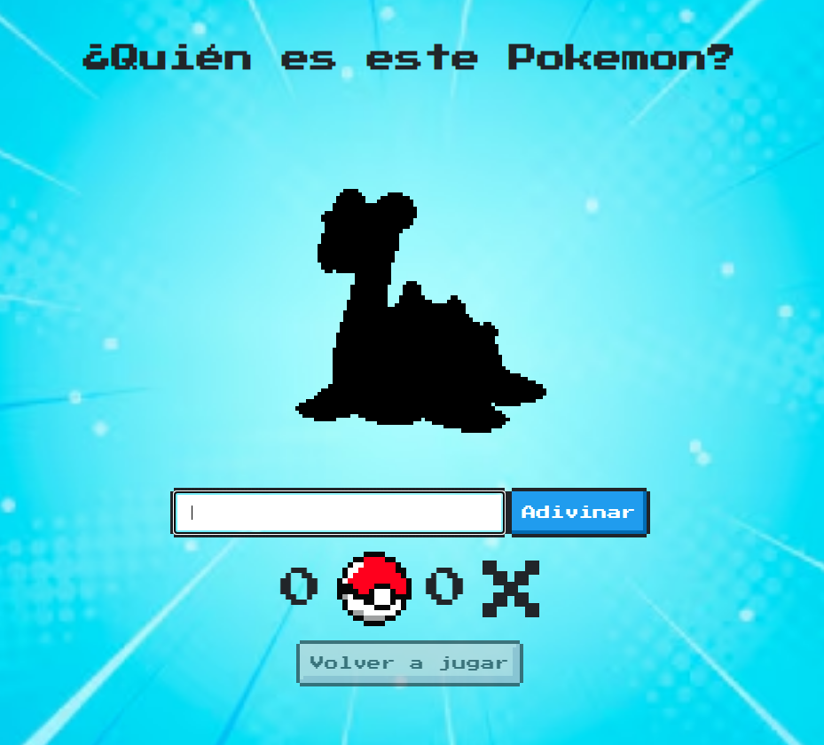

# Who's That Pokémon?

This is a Pokémon guessing game web application. The user is presented with an image of a Pokémon and has to guess its name. The game keeps track of the user's score using localstorage.

### Tech Stack:

- **Vite**: A modern JavaScript bundler for building performant web applications.
- **React**: A JavaScript library for building user interfaces.
- **TypeScript**: A superset of JavaScript that adds static typing for enhanced code reliability.
- **NES.css**: NES-style (8bit-like) CSS Framework.

### Disclaimer
This game is not affiliated with Nintendo or The Pokémon Company. It is a fan-made project.